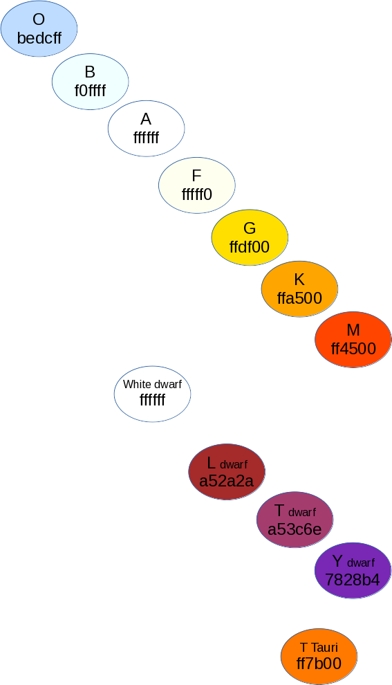

# edsn
ED:SN - Elite Dangerous: Star Neighbourhood is a set of tools to prepare a 3d map of surroundings of one of million star systems in Elite Dangerous.
With 0.2 release the Python script became the main tool.
It calls [EDSM](https://www.edsm.net/) API to obtain required information and store into a file in a GNUplot data format.
Additionally, the script prepares a GNUplot script file ready to run.
The [GNUplot](http://gnuplot.sourceforge.net/) script taking as an input list of star systems and producing 3D star map.
Finally, there is an example data file, original GNUplot script and the [image](examples/release_0.1/example_map.jpg) of the output map in the [examples](examples/release_0.1) folder.

.

## Python

The [prepare_data.py](prepare_data.py) takes as an input the name of star system from Elite Dangerous and the radius defining how much space around it to draw on the map.
If no arguments are specified the script prepares information for a map of V1688 Aquilae 15 light years neighbourhood.
Information are downloaded from the EDSM website and saved into a json cache file (*create_cache* function).
The script uses a main star type as a base for integer representation of the RGB colour matching stars colour (*def_color* function).
It translates stars coordinates by shifting the origin of a coordinate system into the central star (*prepare_gnuplot_data* function).
Finally, it prepares a GNUplot script file to saved into the output datafile (*save_script* function).

Please note that the list of translated main body types is limited.
It can be found in the *def_color* function.

## GNUplot
Each prepare_data.py script run prepares a pair of files.
* <system_name>-<radius>.3d.dat consists of data .
* <system_name>-<radius>.gnuplot is ready to use Gnuplot script.

### Script description

The script takes data file name as an input.
It's can be changed in the line 18.
Graph title is defined in line 14.
The radius of circles are controlled by the "radius" variable in line 5 and the number of them is set by a loop in line 16.
The are draw by a function in line 17.
Circle representing stars systems are added in the line 19.
Their black perimeter in the next line and names in line 18
Finally, in the line 21 images is enriched by a doted line connecting 'surface' with a star location.

### Input data specification

There are 5 columns in the data file.
The first one is the star system name.
Columns two, three and four are coordinates with a central star in the origin of axes (0,0,0).
The last (fifth) column represent the color of a main star.
It is an integer value of a RGB colour number.
Colours definition are collected in the [star_colours.odg](star_colours/star_colours.odg) (see below).

# Links

* EDSM REST API used by the python script is defined [here](https://www.edsm.net/en/api-v1).
* My script uses tricks presented in the Lee Phillips book titled "[gnuplot 5](https://lee-phillips.org/gnuplot/)".
